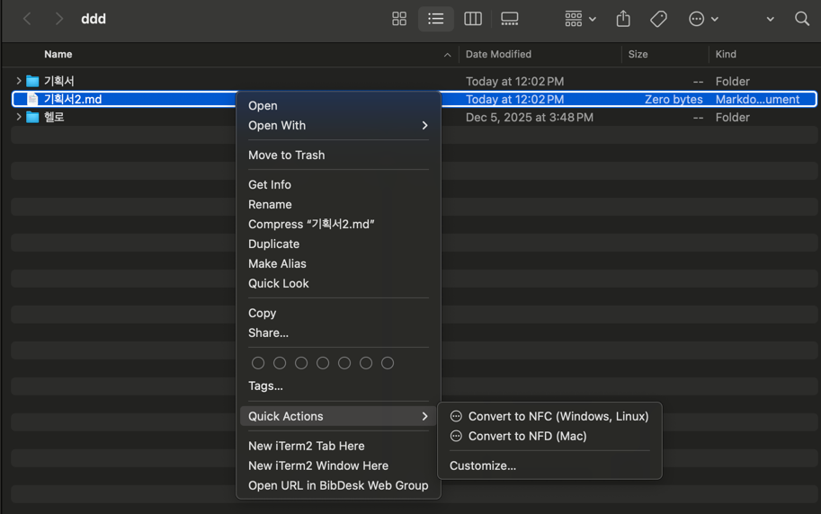

<div align="center" style="text-align: center;">
<h1 style="margin:0; padding: 0;">unicode_norm: Unicode Filename Normalizer</h1>
<div>
    <p>No more "기획서.pdf" turning into "ㄱㅣㅎㅚㄱ서.pdf"</p>
    <p>No more "プログラム.exe" turning into "フ゜ロク゛ラム.pdf"</p>
    <p>No more "résumé.pdf" turning into "re´sume´.pdf"</p>
</div>
<hr style="border:1px solid gray">
<div>
    <p style="margin-bottom: 0.25rem;">Supported Platforms</p>
	
    
    
</div>
<hr style="border:1px solid gray">
<div>
    <p style="margin-bottom: 0.25rem;">Support this project</p>
    <a href="https://www.buymeacoffee.com/arrghsoft" target="_blank"></a>
</div>
<hr style="border:1px solid gray">

<p style="text-align: center;" align="center">
  <strong>
    English |
    <a href="README.ko.md">한국어</a>
  </strong>
</p>
<hr>
</div> 

# unicode_norm: Unicode Filename Normalizer

`unicode_norm` is a CLI tool that makes it easy to normalize Unicode filenames (NFC / NFD).
It was primarily created to solve issues caused by macOS automatically saving filenames in NFD form.

What problem does this solve? Imagine this situation:

> You create a file named résumé.pdf on a Mac and send it to your friends who are using Windows.
> When they receive it, the filename appears as re´sume´.pdf.
> If this happened when sending it to the HR person of the company, it could easily leave a bad first impression.

This issue occurs because macOS uses NFD (Normalization Form Decomposed) by default when storing filenames, while Windows and Linux primarily expect NFC (Normalization Form Composed).
As a result, filenames can appear visually broken across different operating systems.
With unicode_norm, you can easily convert filenames between NFC and NFD, ensuring they display correctly everywhere.

Supported Unicode Normalization Forms
- NFC (Normalization Form Canonical Composition)
- NFD (Normalization Form Canonical Decomposition)
- NFKC (Normalization Form Compatibility Composition)
- NFKD (Normalization Form Compatibility Decomposition)

## ✨ Key Features

- Unicode normalization for file and directory names
- Recursive processing (--recursive, -r)
- Dry-run mode (--dry-run, -d) to preview changes without modifying files
- Supports macOS / Linux / Windows

## 📦 Installation

You can install unicode_norm using Homebrew:

```bash
brew install arrghsoft/tools/unicode_norm
```

After installation, Homebrew will display instructions under “To enable the Finder Quick Action”.
Run the following commands in your terminal to enable Finder Quick Actions for filename normalization:

```bash
$ brew install arrghsoft/tools/unicode_norm
==> Fetching downloads for: unicode_norm
✔︎ Formula unicode_norm (1.0.1)                                  [Verifying   207.3KB/207.3KB]
==> Installing unicode_norm from arrghsoft/tools
==> cmake . -DUNICODE_NORM_LIBRARY_STATIC_LINK=OFF
==> make install
==> Caveats
To enable the Finder Quick Action:
  cp -r "/opt/homebrew/opt/unicode_norm/share/unicode_norm/Convert to NFC (Windows, Linux).workflow" ~/Library/Services/
  cp -r "/opt/homebrew/opt/unicode_norm/share/unicode_norm/Convert to NFD (Mac).workflow" ~/Library/Services/

unicode_norm is an open source software. You can buy a coffee to the developer via: https://buymeacoffee.com/arrghsoft
==> Summary
🍺  /opt/homebrew/Cellar/unicode_norm/1.0.1: 13 files, 352.6KB, built in 1 second
==> Running `brew cleanup unicode_norm`...
Disable this behaviour by setting `HOMEBREW_NO_INSTALL_CLEANUP=1`.
Hide these hints with `HOMEBREW_NO_ENV_HINTS=1` (see `man brew`).
```

This allows you to normalize filenames directly from Finder via right-click → Quick Actions.

Finder Quick Action Screenshot


Windows

On Windows, download the MSI installer from the GitHub Releases page. The installer installs the executable into the Program Files directory and adds Convert to NFC / Convert to NFD options to the right-click context menu via the registry.

On Linux, please build the tool manually using CMake (see build instructions below).
You can also run the following script to add Convert to NFC / Convert to NFD entries to the file manager’s right-click menu:

```bash
./linux/install_script.sh
```


## 🔧 Usage Examples

Normalize a file to NFC:
```bash
unicode_norm -f NFC 파일명
```

Recursively normalize a directory:
```bash
unicode_norm -f NFC -r ~/Downloads/
```

Show help:
```bash
unicode_norm -h
```

## 📘 참고

unicode_norm uses the utf8proc library for Unicode normalization.
On older Macs using HFS / HFS+, filenames are forcibly stored in NFD at the filesystem level, so normalization may not work.
On modern Macs using APFS, both NFC and NFD are supported, allowing unicode_norm to function correctly.


## 🚀Builiding from source

Static linking
```bash
cmake -S . -B build
cmake --build build
```

Dynamic linking
```bash
cmake -S . -B build -DUNICODE_NORM_LIBRARY_STATIC_LINK=OFF
cmake --build build
```

Run tests
```bash
./test.sh
```

Install
```bash
sudo mv build/unicode_norm /usr/local/bin/
```

Uninstall
```bash
sudo rm /usr/local/bin/unicode_norm
```

## 🛠️ Miscellaneous

Bug reports and feature requests are welcome via GitHub Issues.
